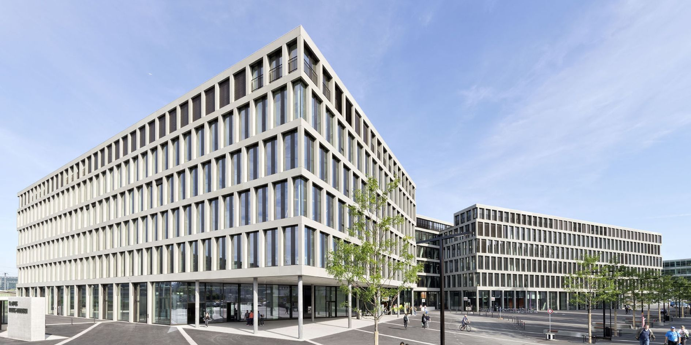

# BSc Electrical and Information Technology

Image source: [https://www.pinterest.ch/...](https://i.pinimg.com/originals/fc/4e/6f/fc4e6fc3ba2c2927620a55f4b5a4e4e2.jpg)

There is hardly any area of life that is not affected by electrical products - be it smart phones, smart homes (the housing of the future) or smart grids (intelligent power grids).

In the BSc Electrical and Information Technology program, value is placed on a sound basic knowledge, which is supplemented by laboratory experiments. At the same time, teams work on interdisciplinary, practice-oriented student projects covering the entire range from microelectronics (e.g. configurable, digital effect devices for guitarists playing electric guitar) to electrical engineering (e.g. power generation with kites).

::: theorem BSc Electrical and Information Technology
Find out more about this bachelor study course.

::: right
From [https://www.fhnw.ch/...](https://www.fhnw.ch/en/degree-programmes/engineering/electrical-and-information-technology)
:::

## :school: FHNW, University of Applied Sciences and Arts

Image source: [https://www.fhnw.ch/...](https://www.fhnw.ch/de/medien/logos/media/fhnw_e_10mm.jpg)

[FHNW](https://www.fhnw.ch/en/startseite) is one of Switzerland’s leading universities of applied sciences and arts, actively involved in teaching, research, continuing education and service provision – both innovative and practice-oriented. Its broad range of degree programmes, hands-on concept, innovative, application-oriented research and global network make [FHNW](https://www.fhnw.ch/en/startseite) a diversified and appealing educational institution, a sought-after partner to industry and an attractive employer in northwestern Switzerland.

The [FHNW](https://www.fhnw.ch/en/startseite) fulfils a fourfold mandate from the Swiss Federation and the Swiss Conference of Cantonal Ministers of Education (EDK): education/training, applied research and development, continuing education, and services to third parties.

### Education/Training
* 29 bachelor's degree programmes (Bachelor of Science/BSc and Bachelor of Arts/BA) with 10,355 students
* 17 master's degree programmes (Master of Science/MSc and Master of Arts/MA) with 2,064 students

### Applied Research and Development
* 1,251 projects with industry partners contributing external funds of CHF 56,5 million and a self-financing ratio of 81 percent (direct costs)

### Continuing Education
* 3,408 qualifications issued, including
    * 391 for Master of Advanced Studies (MAS) programmes
    * 224 for Diploma of Advanced Studies (DAS) programmes
    * 2,793 for Certificate of Advanced Studies (CAS) programmes
    * External funds of CHF 48,2 million with a self-financing ratio of 158 percent (direct costs)

### Services
* 371 projects with external funds of CHF 8,3 million and a self-financing ratio of 123 percent (direct costs)

::: theorem University of Applied Sciences and Arts
Find out more about the FHNW University of Applied Sciences and Arts.

::: right
From [https://www.fhnw.ch/en](https://www.fhnw.ch/en)
:::

## :mortar_board: Bachelor Thesis

The Bachelor Thesis is decisive for the transition into professional life. Depending on the problem, the project contains aspects from the fields of hardware or software development, simulation or calculation. The following contents are implemented and evaluated.

Contents:
* Familiarization with the topic
* Preparation of the project clarification including specification sheet and project plan
* Implementation phase (technical work, where engineering and result-oriented approach should be demonstrated)
* Project management (implementation of milestones, communication with the customer and the supervisor, project controlling)
* Documentation of the project results (report, poster and website)
* Poster exhibition and defence

::: tip Preliminary Project for Bachelor Thesis
The project description on this website includes the preliminary project for the Bachelor Thesis. This preliminary project is carried out during half a year and serves as a proof of concept. With this preliminary study the feasibility of the Bachelor Thesis should be checked and some knowledge should be acquired. 
:::