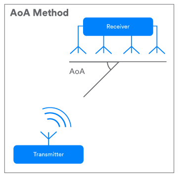
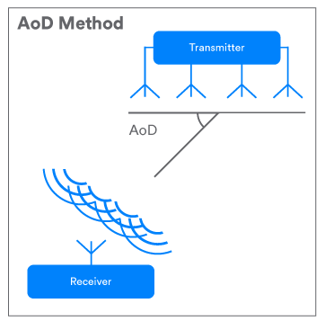

# Bluetooth® Direction Finding

Image source: [https://www.elsate.com/...](https://www.elsate.com/static/1/2019/20190129143021.jpg)

<!-- Verschiedene Ortungsdienste sind seit jeher gefragt. Das bekannteste Ortungssystem ist wohl GPS. Nebst der grossen flächendeckenden Verfügbarkeit birg dieses System aber einige nachteile. GPS kann beispielsweise die Position nur auf einige Meter genau berechnen und funktioniert nur im Freien. Vermehrt werden aber Echtzeit-Ortungsdienste (RTLS) benötigt, welche in echtzeit eine zentimetergenaue position berechnen können. Diese Ortungsdienste werden oftmals in Gebäuden eingesetzt, wo GPS nicht funktioniert. Für solche Dienste wurden vielmals eigene Systeme auf Basis von Bluetooth oder WLAN triangulation entwickelt. Eine verbreitete möglichkeit war zum Beispiel, die Position mittels triangulation der signalstärken (RSSI) zu berechnen.
Glücklicherweise wurde der Bluetooth-Technologie mit der Version 5.1 eine optionale Funktion hinzugefügt, die die Entwicklung von Ortungsdienstlösungen ermöglicht, welche eine zentimetergenaue Leistunganforderung erfüllen. -->

Various positioning services have always been in demand. The best known tracking system is probably GPS. Besides the large area-wide availability, this system has some disadvantages. For example, GPS can only calculate the position to within a few meters and only works outdoors. Real-time positioning services [(RTLS)](https://en.wikipedia.org/wiki/Real-time_locating_system) are increasingly required, which can calculate a position in real time with centimetre accuracy. These tracking services are often used in buildings where GPS does not work. For such services, many proprietary systems based on Bluetooth or WLAN triangulation have been developed. A common way of calculating the position, for example, was to use triangulation of the signal strength [(RSSI)](https://en.wikipedia.org/wiki/Received_signal_strength_indication).
Fortunately, with version 5.1, an optional feature has been added to Bluetooth technology, allowing the development of positioning service solutions that meet centimetre-precise performance requirements.

## Adding Direction Finding
<!-- 
Als Funkpeilung versteht man die Praxis der Bestimmung einer Richtung, aus welcher ein empfangenes Signal gesendet wurde. Seit dem frühen zwanzigsten Jahrhundert ist dies in der Praxis üblich und wird in diversen Systemen verwendet. Von der Luftfahrt über die nautische Navigation bis hin zur Wildtierortung findet diese Praxis ihr Einsatz.
Mit der Version 5.1 der Bluetooth Core Specification wurde Bluetooth um eine optionale Funkpeilung erweitert. Ein Bluetooth-Gerät kann mit dieser Funktion die Richtung eines Signales bestimen, welches von einem anderen Bluetooth-Gerät wie beispielsweise einem Handy oder Tablet gesendet wurde. Diese Erweiterung hat das Potenzial, Bluetooth-Ortungsdienste zu verbessern und eine breitere Unterstützung zu gewährleisten.
Bisherige Bluetooth-Ortungsdienste verwenden RSSI zur Schätzung der Entfernung des sendenden Gerätes. Solche Ortungsdienste basierend auf der Triangulation mittels mehrerer Auswertestationen. Nun können dieselben Geräte auch zur Bestimmung der Empfangsrichtung verwendet werden und so die Positionsgenauigkeit verbessern.
Die Funkpeilung der neuen Bluetooth Core Specification unterstützt zwei Methoden zur Richtungsbestimmung, welche auf der Verwendung eines Antennenarrays basieren: Ankunftswinkel (AoA) und Abflugwinkel (AoD). -->

Radio direction finding is the practice of determining a direction from which a received signal has been transmitted. This has been common practice since the early twentieth century and is used in various systems. From aviation to nautical navigation and wildlife tracking, this practice is used in a variety of applications.
With version 5.1 of the Bluetooth Core Specification, Bluetooth has been extended by an optional radio direction finding. A Bluetooth device can use this function to determine the direction of a signal sent by another Bluetooth device such as a mobile phone or tablet. This extension has the potential to improve Bluetooth location services and provide broader support.
Previous Bluetooth location services use RSSI to estimate the distance of the sending device. Such location services are based on triangulation using multiple evaluation stations. Now the same devices can also be used to determine the direction of reception and thus improve the position accuracy.
The radio direction finding of the new Bluetooth Core Specification supports two methods of direction finding based on the use of an antenna array: angle of arrival (AoA) and angle of departure (AoD).

## Direction Finding Using Angle of Arrival (AoA)

Image source: [https://www.bluetooth.com/...](https://3pl46c46ctx02p7rzdsvsg21-wpengine.netdna-ssl.com/wp-content/uploads/2019/03/Figure_AoA.png)

<!-- Bei der AoA-Methode (Angle of Arrival) sendet ein Bluetooth Beacon, zu welchem die Richtung bestimmt werden soll, ein spezielles Peil-Signal mit einer einzigen Antenne. Das Empfangsgerät in derselben RTLS-Lösung, welches mehrere Antennen in einem Antennenarray hat, kann aufgrund den Abstandsunterschieds der einzelnen Antennen eine Signalphasendifferenz erkennen. Das Empfangsgerät nimmt dabei die IQ-Abtastwerte des Signals auf, während zwischen den einzelnen aktiven Antennen umgeschalten wird. Mit diesen Daten kann nun die Signalrichtung berechnet werden. AoA-Systeme sind für Verwendungen mit RTLS sowie Item-Finding und Point-of-Interest Informationsdienste (PoI) vorgesehen. -->

With the Angle of Arrival method (AoA), a Bluetooth beacon, to which the direction is to be determined, transmits a special direction finding signal with a single antenna. The receiver in the same RTLS solution, which has several antennas in an antenna array, can detect a signal phase difference due to the difference in distance between the individual antennas. The receiver takes the IQ samples of the signal while switching between the individual active antennas. With this data, the signal direction can be calculated.
AoA systems are intended for use with RTLS as well as item finding and point-of-interest information services (PoI).

## Direction Finding Using Angle of Departure (AoD)

Image source: [https://www.bluetooth.com/...](https://3pl46c46ctx02p7rzdsvsg21-wpengine.netdna-ssl.com/wp-content/uploads/2019/03/Figure_AoD.png)

<!-- Bei der AoD-Methode (Angle of departure) sendet das Gerät, zu welchem die Richtung bestimmt werden soll, ein spezielles Signal. Dieses Signal wird mit mehreren Antennen in einem Array gleichzeitig gesendet. Das Empfangsgerät, beispielsweise ein Mobiltelefon, benötigt nur eine Antenne. Sobald das Mehrfachsignal die Antenne im Empfangsgerät kreuzt, nimmt das Empfangsgerät IQ-Proben. Mit diesen IQ-Probedaten kann das Empfangsgerät nun die relative Signalrichtung berechnen. Die AoD-Methode ist für die Verwendung in IPS-Lösungen, wie beispielsweise der Wegbestimmung in einem Gebäude, vorgesehen. -->

With the Angle of departure method (AoD) the device to which the direction is to be determined sends a special signal. This signal is transmitted simultaneously with several antennas in an array. The receiving device, for example a mobile phone, only needs one antenna. As the multiple signal crosses the antenna in the receiving device, the receiving device takes IQ samples. With this IQ sample data, the receiver can now calculate the relative signal direction. The AoD method is intended for use in IPS solutions, such as determining the path in a building.

Sources from [https://www.bluetooth.com/...](https://www.bluetooth.com/blog/new-aoa-aod-bluetooth-capabilities/)