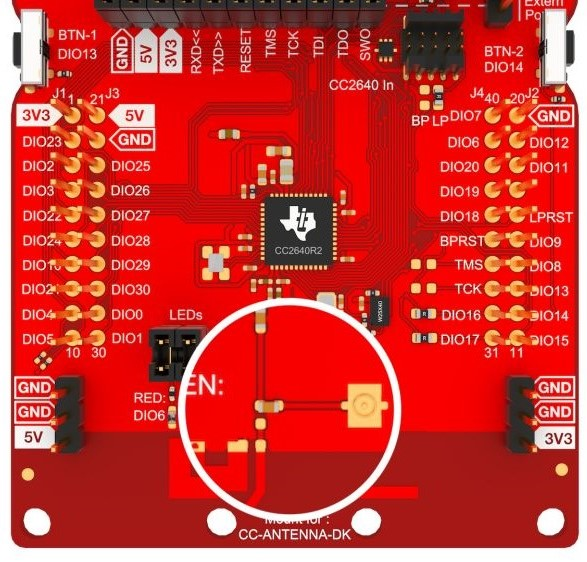
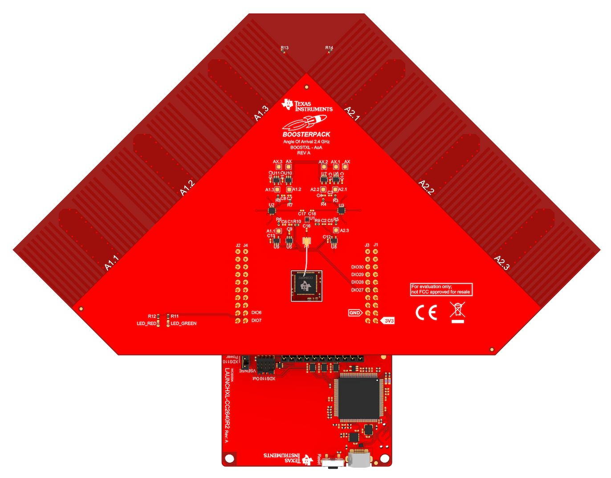

# :wrench: Preparations

::: theorem Angle of Arrival BoosterPack™
The Angle of Arrival BoosterPack™ kit (BOOSTXL-AOA) was used for this project. This page contains images and text from Texas Instruments developer hub. For the original documentation and sources please refer to the Ti developer hub.

::: right
From [dev.ti.com](http://dev.ti.com/tirex/explore/node?node=AHckEvhg0Y3xs5rlangU2w__FUz-xrs__LATEST)
:::

## Configuration for external antenna

To connect the CC2640R2 LaunchPad to an external antenna, the capacitor C51 must be moved. The pictures below show the relocation.

|||
|:------|:-----------|
| PCB antenna   | External antenna |

## Mounting

Next the LaunchPad is connected to the BOOSTXL-AOA with the supplied JSC cable. All 40 BOOSTXL-AOA pins must be connected to the 40 LaunchPad pins.

The hardware setup is now ready for development!
