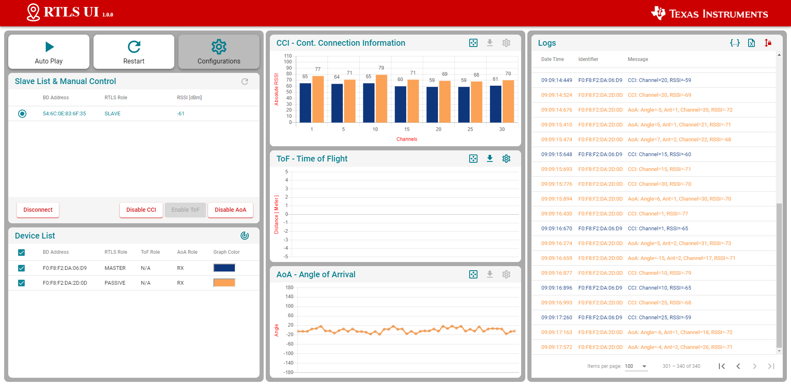

# :computer: RTLS Agent

::: theorem RTLS Agent
The RTLS Agent is required to connect RTLS Master, Slave and Passive through a phyton application. The setup is described on the Ti developer Hub. 

::: right
From [dev.ti.com](http://dev.ti.com/tirex/explore/node?node=AFdhXxh4okvOMvB7TA5rdA__krol.2c__LATEST&search=rtls%20agent)
:::

RTLS Master and RTLS Passive are connected to the RTLS Agent (Node Manager) via a serial interface. The agent is used to establish the connection between the nodes and to evaluate measurement results. CCI (Continous Connection Information) and AoA (Angle of Arrival) information is evaluated for the upcoming measurements. After each measurement, the log is exported to a CSV file and viewed in detail under [Measurements](/measurements/environment). Below is an overview of the graphical user interface of the RTLS Agent.

