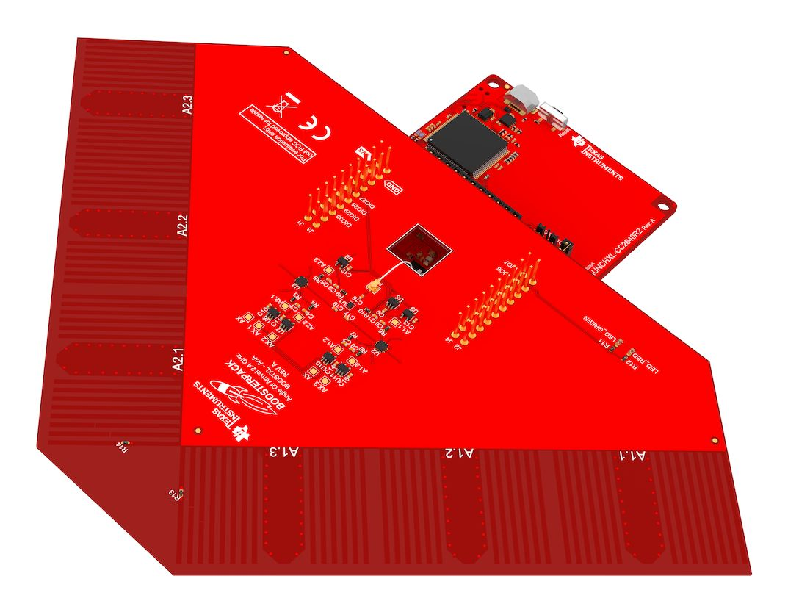
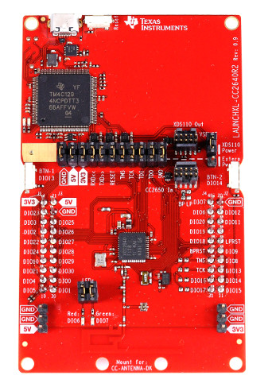
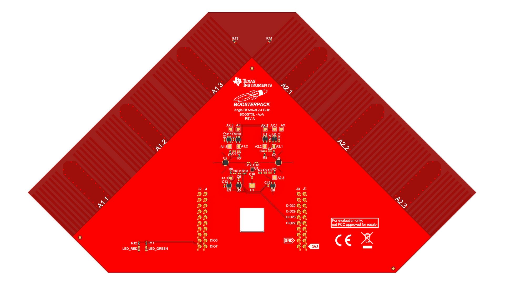

# :artificial_satellite: Hardware <Badge text="WIP" type="warning"/>

::: theorem Angle of Arrival BoosterPack™
The Angle of Arrival BoosterPack™ kit (BOOSTXL-AOA) was used for this project. This page contains images and text from Texas Instruments developer hub. For the original documentation and sources please refer to the Ti developer hub.

::: right
From [dev.ti.com](http://dev.ti.com/tirex/explore/node?node=AHckEvhg0Y3xs5rlangU2w__FUz-xrs__LATEST)
:::

## Angle of Arrival BoosterPack™

The Angle of Arrival BoosterPack™ kit (BOOSTXL-AOA) is an easy-to-use plug-in module equipped with antenna arrays suitable for evaluation of Angle of Arrival applications. The 2 orthogonal antenna arrays each consist of 3 dipole antennas tuned for operation at 2.4 GHz. The antennas are selected with RF switches and then connected to a single JSC connector. The JSC Series connector is used to connect to an AoA compatible RF receiver like the CC2640R2 LaunchPad™.

### Key Features
* Two antenna arrays with three 2.4 GHz dipole antennas on each
* RF switches to switch between the different antennas
* JSC RF connector
* Two LEDs

## CC2640R2 LaunchPad™

The CC2640R2F is a wireless MCU targeting Bluetooth 5 (single-mode BLE) and proprietary applications. The CC2640R2F device contains a 32-bit ARM® Cortex®-M3 processor running at 48 MHz as the main processor, in addition to a 2nd programmable CPU ideal for ultra low-power sensor reading and data processing. It can run independently of the main ARM® Cortex®-M3 MCU and handle sensor polling using just a few µA of average current.

* On-board emulation tool (XDS110) for flashing & debugging firmware on the target CC2640R2F device
* 40-pin dual-gender BoosterPack connectors
* CC2640R2F Microcontroller device
* User red & green LEDs
* 2x User switches
* Access to all GPIO pins of the CC2640R2F device
* 8 Mbit serial (SPI) flash memory for firmware updates

##  BOOSTXL-AoA

The BOOSTXL-AOA demonstration board is a BoosterPack intended to be used with the CC2640R2F LaunchPad, to evaluate Angle-of-Arrival (AoA) applications. The BOOSTXL-AOA is setup with multiple dipole antennas that are utilized to extract information about where a signal comes from. This is done by a combination of software techniques developed by TI, ranging from antenna switching to sophisticated algorithms that calculate the angle of arrival of received signals.

* 40-pin BoosterPack standard leveraging the LaunchPad ecosystem
* JSC connector to extend RF path from a Launchpad
* 6 integrated PCB-based dipole antennas
* 3 antenna switches
* 2 LEDs (Green/Red)
