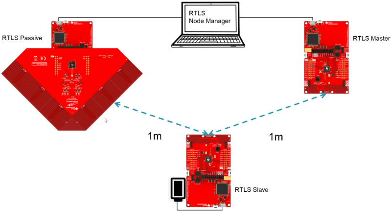

# :microscope: Test setup

::: theorem RTLS System
This RTLS System setup guide contains information from Ti developer hub containing information about the hardware setup and additional information for a working test environment. 

::: right
From [dev.ti.com](http://dev.ti.com/tirex/explore/node?node=APaTcMsT.l887nrPYsKajg__krol.2c__LATEST&search=aoa)
:::

This page contains information about how to setup the AoA demo from Ti and which control commands are accepted by RTLS Control software.

## Software Setup

For a working AoA example, there are three different roles which take care of the calculation and the function of AoA.

### RTLS Master
* For RTLS Master and RTLS Slave projects, the configuration <code>-DRTLS_LOCATIONING_AOA</code> in <code>build_config.opt</code> file that is located in the project directory, controls the build.
* To build AoA, keep the option uncommented: <code>-DRTLS_LOCATIONING_AOA</code>
* Master role will not collect I/Q samples

### RTLS Slave
* For RTLS Master and RTLS Slave projects, the configuration <code>-DRTLS_LOCATIONING_AOA</code> in <code>build_config.opt</code> file that is located in the project directory, controls the build.
* To build AoA, keep the option uncommented: <code>-DRTLS_LOCATIONING_AOA</code>
* Slave will send out a constant tone at the end of connection packet and it will not collect I/Q samples

### RTLS Passive
* <code>RTLS_LOCATIONING_AOA</code> must be defined in predefined symbol/preprocessor symbol.
* Passive will collect I/Q samples
* When using AoA raw output mode (AOA_MODE_RAW), consider the following:
    * Connection interval of BLE must be at least 300ms to accomodate outputing all of the samples (a large 2k bytes chunk)
    * Large amounts of heap will be used to support this mode

## Hardware Layout

Image source: [http://dev.ti.com/...](http://dev.ti.com/tirex/explore/content/simplelink_academy_cc13x2_26x2sdk_3_40_00_00/modules/rtls_toolbox_ble5/rtls_intro/resources/suggested_layout.png)