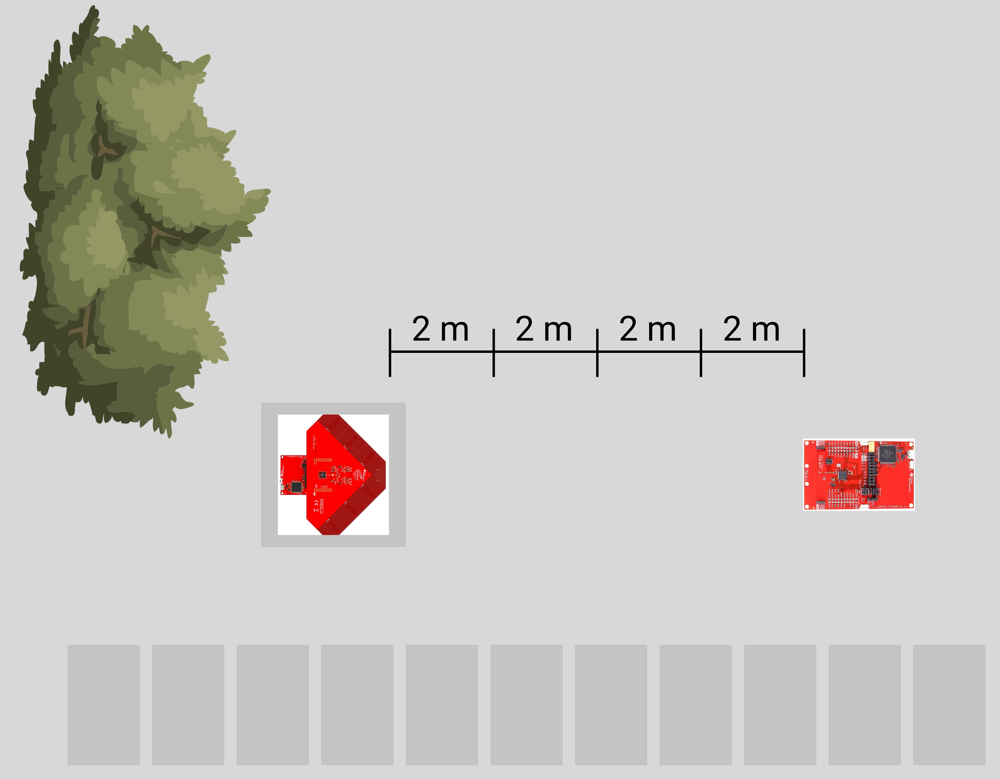
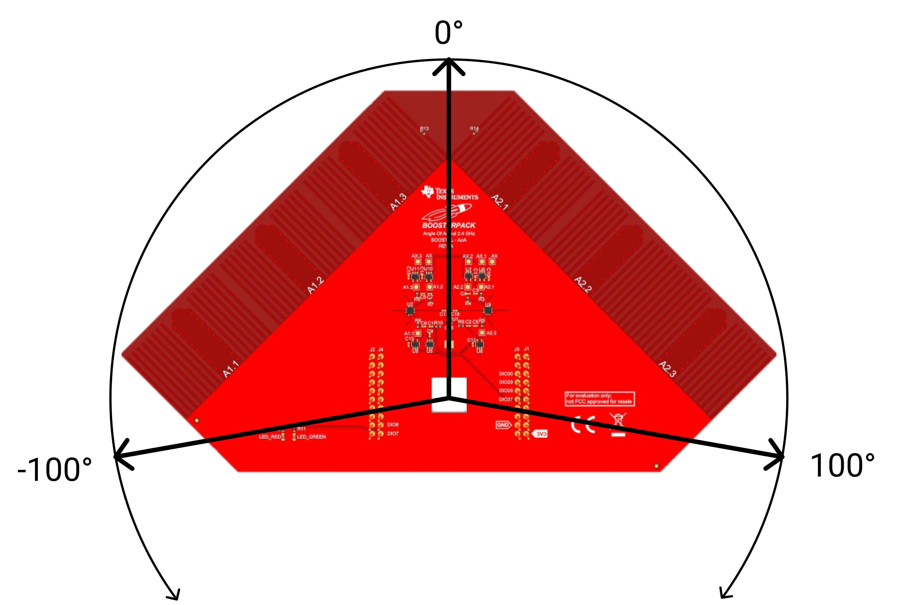
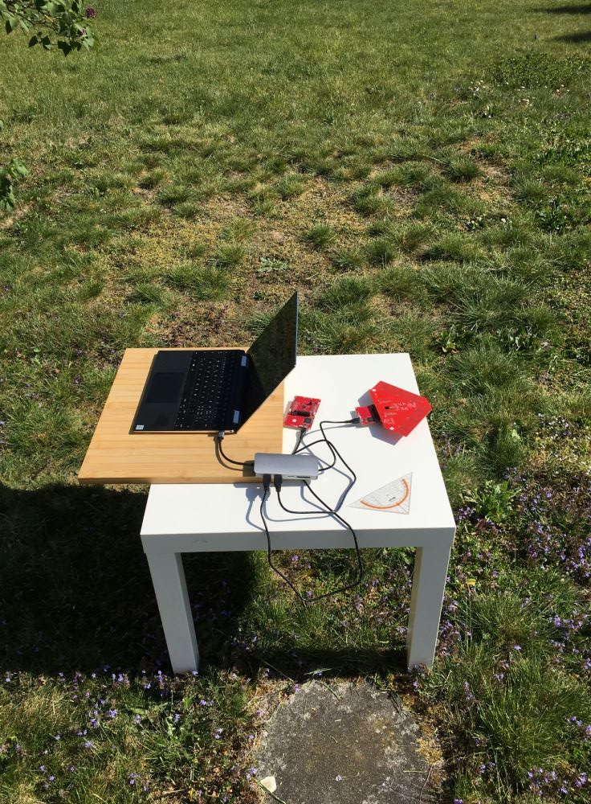
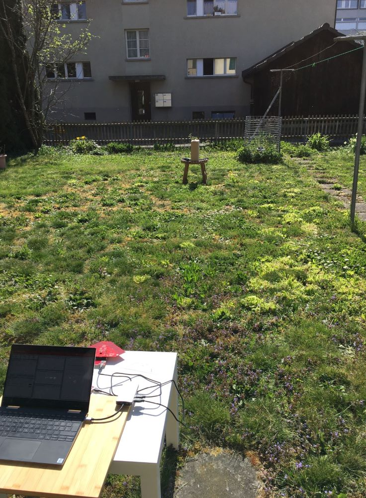

# Distance
The measurements outside should give an approximate indication of how accurate measurement results can be made in open terrain. During these measurements all interfering signals such as mobile phones or laptop radio signals were switched off. There are also no large objects in the surrounding area which could influence the measured values by reflections. In order to be able to analyze the signal strength (RSSI) of the angle evaluation, measurements are made at the same angle but at different distances.

## Measurement Setup

The following measurements were made outside in the garden. The arrangement of RTLS passive and RTLS slave is shown below. Both modules are located 76 cm above the floor (table height). The RTLS Master is also on the table, but is not shown for simplicity.

In the following experiments the antenna array (RTLS Passive) is rotated between -100° and 100°. -100° is on the left side of the array, 100° on the right. If the antenna array is pointing straight at the RTLS slave, the test setup is at an angle of 0°.

## Real Environment

|||
|:------|:-----------|

## Measurement Results <Badge text="WIP" type="warning"/>
<LineChartContainer 
    :PathList="[
        '/assets/data/Measurements/Distance/2m.csv',
        '/assets/data/Measurements/Distance/4m.csv',
        '/assets/data/Measurements/Distance/6m.csv',
        '/assets/data/Measurements/Distance/8m.csv'
    ]"
    :btnText="[
        '2m',
        '4m',
        '6m',
        '8m',
    ]"
/>

