# Double Antenna Array

A functioning positioning system needs at least two antenna arrays to calculate an intersection point and thus a position. This measurement series records the angular values at twelve different positions in a grid in order to be able to make a statement about the scattering of the measured position. The aim here is to determine how accurately a system with only two antenna arrays can determine a position. 

The measurement setup consists of two antenna arrays and a slave module. The nine red rectangles represent the different measurement positions of the slave module. The left and right measurement series are each 0° in front of the one antenna array, the middle measurement series exactly in between. The distance of the measurements are at 4m, 6m and 8m, all modules are 76cm above the ground.

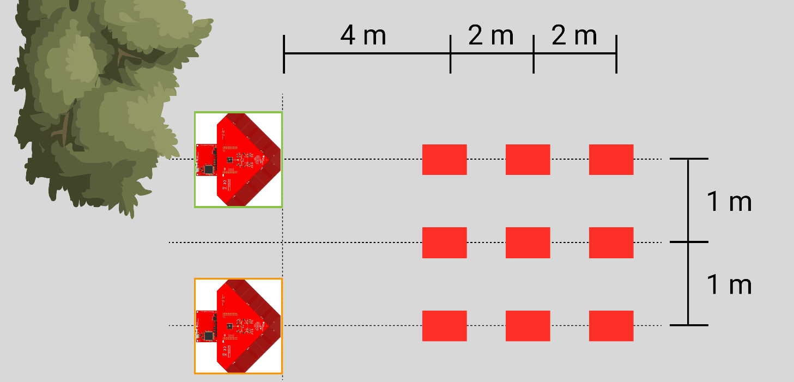

The following measurement evaluations are divided into measurements left, middle and right. The view is from behind the antenna arrays and is sketched separately below. To make the evaluation more clearly arranged, the left antenna array is highlighted in green and the right one in orange. The measurement results are colored in these colors.

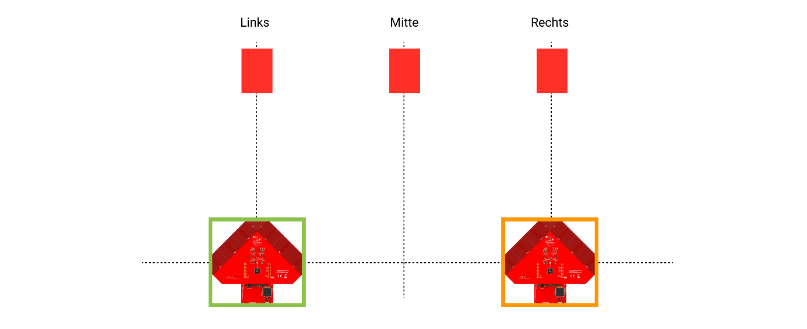

## Evaluation Matrix

Values were recorded for 5 minutes at each of the nine measuring positions. The measurement series were averaged and the average values are shown in the table below. 

If the signal strengths are compared, the results of the respective green antenna arrays or the orange antenna arrays should be close together at the same distance. At a distance of 4m the maximum difference is 1.33 dBm, at 6m about 5.80 dBm and at 8m about 5.12 dBm. 

Some interesting points are noticeable in the angle evaluation. According to the measurement positions on the layout, the angles of the central positions should be the same for both antenna arrays. Since the antenna arrays and also the slave module were aligned by naked eye, these deviations can be explained. If the positions left and right are compared, the angle of the green antenna array should be the same as the angle of the orange antenna array. If we take the distance 6m, the green angle of the left measurement position is 3.97°. With the orange angle of the right measurement it is 3.43°. This small deviation can again be explained by the positioning.

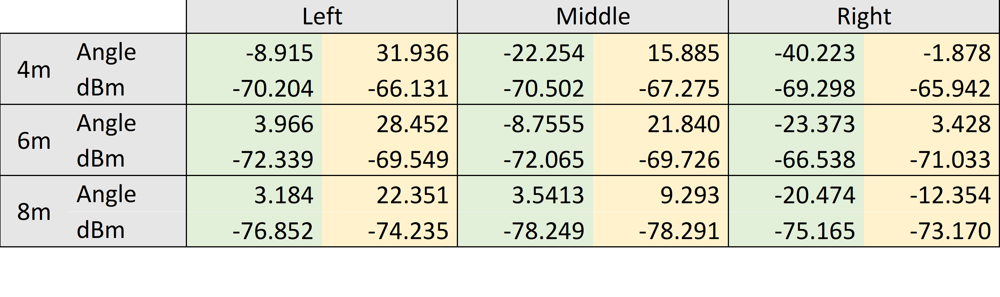

From this table now the maximum angle difference is compared. It can be seen that the inaccuracy of the angle measurement is not directly related to the distance. Rather, a statement can be made about the orientation of the antenna array. Comparing the results with the measurement setup, it is noticeable that measurements are more accurate by ±45° than measurements at 0° or ±90°. This will be explained further in the following section.

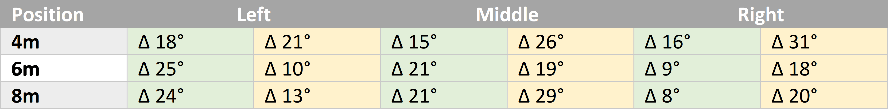

## Scattering and Measurement Deviation

The reference to the dispersion of the measuring positions is shown in the table below. Based on the measured angles and the positions of the antenna arrays the intersections of the angle measurements were calculated. These correspond to the measured position intersections of the slave module. The theoretical measurement position is shown in black, the distribution of the measurement points indicates the measurement accuracy at this position. 

|       | Left      | Middle    | Right     |
|:------|:----------|:----------|-----------|
| 4m    |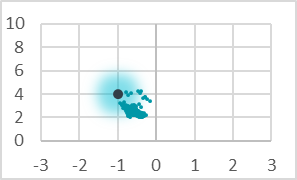|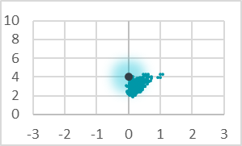|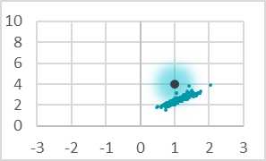|
| 6m    |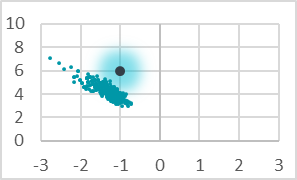|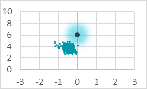|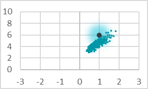|
| 8m    |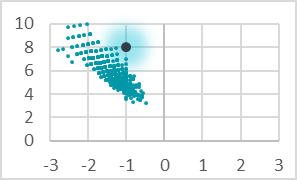|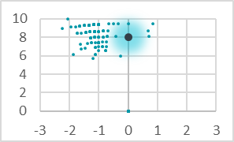|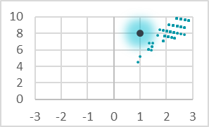|

In these measurement grids it is easy to see how the measurement accuracy decreases with increasing distance. If the scattering is approx. 2m at a distance of 4m, it is already approx. 4m when measuring at 6m distance. It is also noticeable that the angular accuracy at ±45° to the antenna array is the most accurate. This observation could already be seen in previous chapters and is confirmed here again. The deviation of the theoretical measuring position from the measured position scattering can again be attributed to the antenna arrays aligned by eye. To eliminate this measurement offset, a calibration function could be programmed into the measuring system.
