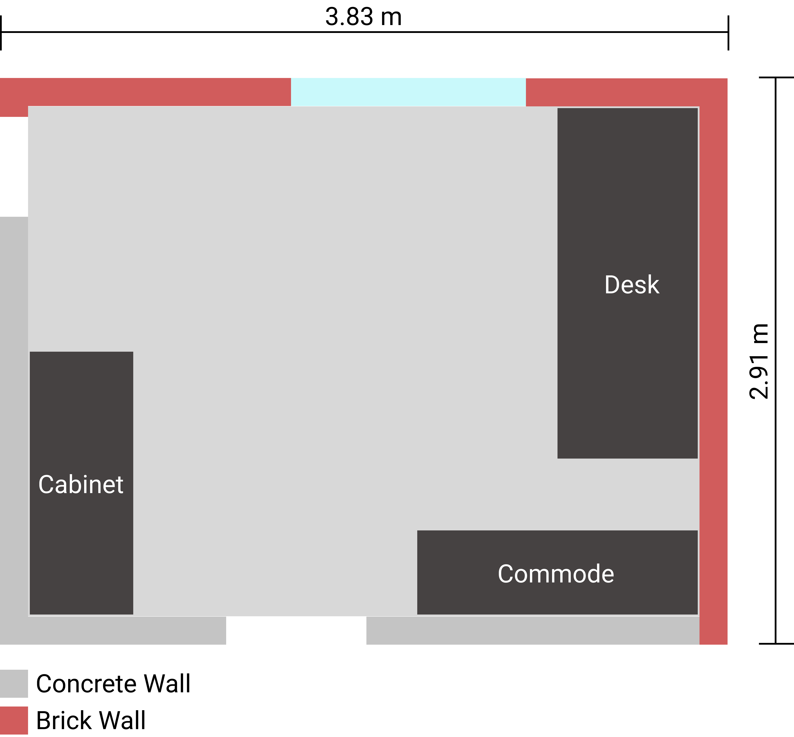
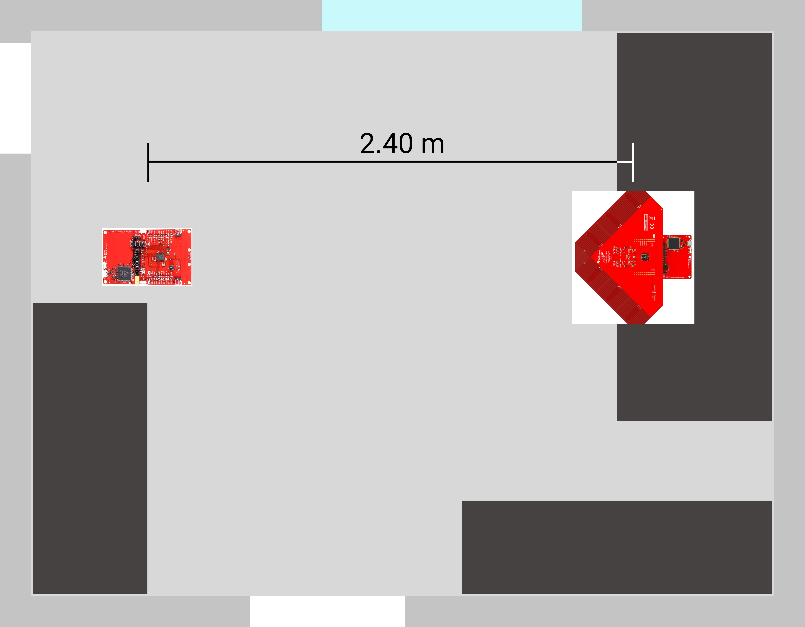

# Office Environment
## Measurement Setup
The following measurements were carried out in the offices described here. In addition to the large pieces of furniture, the office also contains various smaller items such as a monitor or office chair. These objects are not shown for the sake of clarity.

The arrangement of the RTLS Passive and RTLS Slave is shown below. Both modules are located 76 cm above the floor (table height). The RTLS Master is also on the table, but is not shown for simplicity.

In the following experiments the antenna array (RTLS Passive) is rotated between -100° and 100°. -100° is on the left side of the array, 100° on the right. If the antenna array is pointing straight at the RTLS slave, the test setup is at an angle of 0°.

## Other Signals <Badge text="WIP" type="warning"/>

## Measurement Results <Badge text="WIP" type="warning"/>
<LineChartContainer 
    :PathList="[
        '/assets/data/Measurements/Indoor/minus90degree.csv',
        '/assets/data/Measurements/Indoor/minus45degree.csv',
        '/assets/data/Measurements/Indoor/0degree.csv',
        '/assets/data/Measurements/Indoor/45degree.csv',
        '/assets/data/Measurements/Indoor/90degree.csv',
        '/assets/data/Measurements/Indoor/sweep.csv'
    ]"
    :btnText="[
        '-90°',
        '-45°',
        '0°',
        '45°',
        '90°',
        'Sweep'
    ]"
/>
