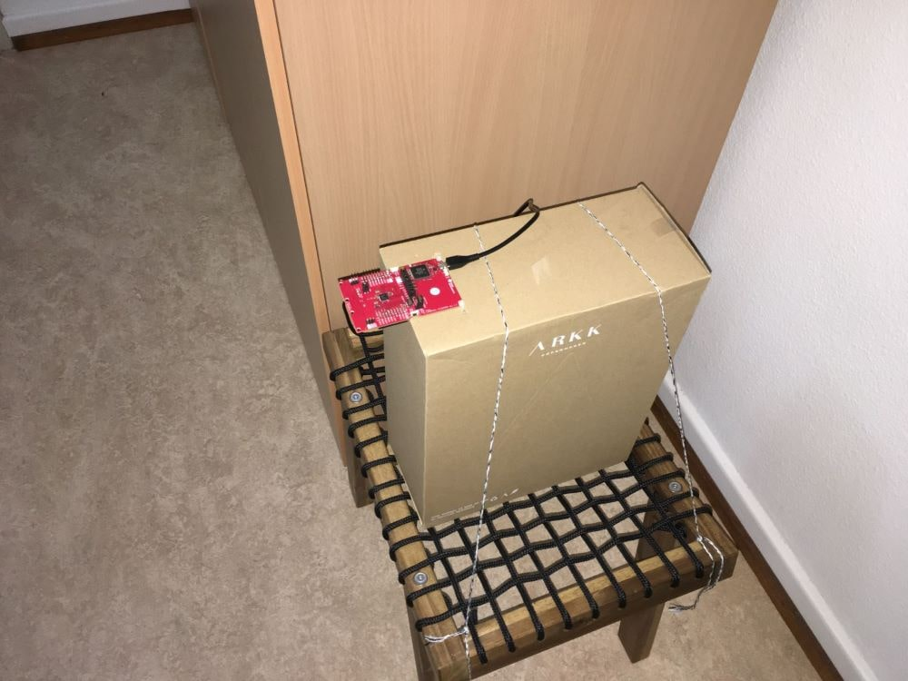
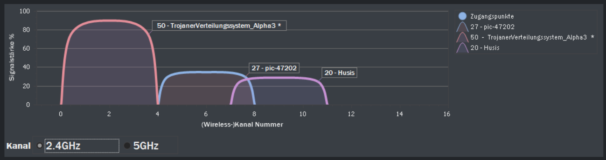

# Office Space

The measurements in the office space are not intended to determine the accuracy of the antenna arrays. As mentioned by the manufacturer, the AoA system is not yet able to make accurate measurements in office spaces. These measurements should show how the measurement results can be influenced by reflections (on walls and furniture) and interfering signals.

## Measurement Setup
The following measurements were carried out in the offices described here. In addition to the large pieces of furniture, the office also contains various smaller items such as a monitor or office chair. These objects are not shown for the sake of clarity.

The arrangement of the RTLS Passive and RTLS Slave is shown below. Both modules are located 76 cm above the floor (table height). The RTLS Master is also on the table, but is not shown for simplicity.

In the following experiments the antenna array (RTLS Passive) is rotated between -100° and 100°. -100° is on the left side of the array, 100° on the right. If the antenna array is pointing straight at the RTLS slave, the test setup is at an angle of 0°.

## Real Environment

|||
|:------|:-----------|

## Interference Signals

As is usual in offices, other Wifi or Bluetooth signals are already available. At the beginning of the measurements the existing Wifi signals were detected. Additionally, a Philips Hue system (Zigbee) is installed, which is not visible on the following overview. The Philips Hue Bridge is located in the same room as the measurements were made. All these sources of interference were deliberately not switched off in order to simulate a real application area. For more accurate measurements, which are used to determine the measurement accuracy, the measurements were performed [outdoor](/measurements/outdoor).

## Measurement Results <Badge text="WIP" type="warning"/>
<LineChartContainer 
    :PathList="[
        '/assets/data/Measurements/Indoor/minus90degree.csv',
        '/assets/data/Measurements/Indoor/minus45degree.csv',
        '/assets/data/Measurements/Indoor/0degree.csv',
        '/assets/data/Measurements/Indoor/45degree.csv',
        '/assets/data/Measurements/Indoor/90degree.csv',
        '/assets/data/Measurements/Indoor/sweep.csv'
    ]"
    :btnText="[
        '-90°',
        '-45°',
        '0°',
        '45°',
        '90°',
        'Sweep'
    ]"
/>
