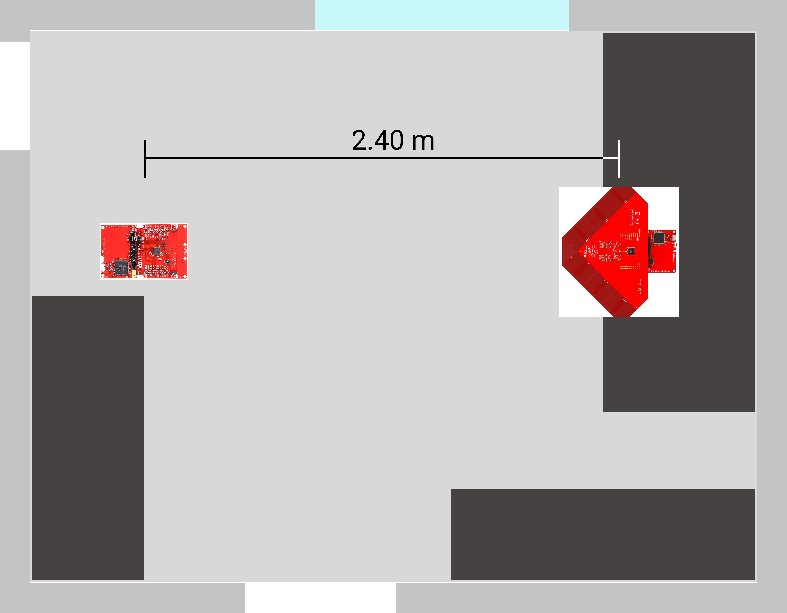

# Single Antenna Array Indoor

The accuracy of a position measurement system depends on each individual antenna array. The following measurements deal with the variance and inaccuracy of a single antenna array. 

As mentioned by the manufacturer, the AoA system is not yet able to make accurate measurements in office spaces. These measurements should show how the measurement results can be influenced by reflections (on walls and furniture) and interfering signals.

## Measurement Setup
The following measurements were carried out in the offices described here. In addition to the large pieces of furniture, the office also contains various smaller items such as a monitor or office chair. These objects are not shown for the sake of clarity.

The arrangement of the RTLS Passive and RTLS Slave is shown below. Both modules are located 76 cm above the floor (table height). The RTLS Master is also on the table, but is not shown for simplicity.

|||
|:------|:-----------|

In the following experiments the antenna array (RTLS Passive) is rotated between -100° and 100°. -100° is on the left side of the array, 100° on the right. If the antenna array is pointing straight at the RTLS slave, the test setup is at an angle of 0°.

## Real Environment

|||
|:------|:-----------|

## Interference Signals

As is usual in offices, other Wifi or Bluetooth signals are already available. At the beginning of the measurements the existing Wifi signals were detected. Additionally, a Philips Hue system (Zigbee) is installed, which is not visible on the following overview. The Philips Hue Bridge is located in the same room as the measurements were made. All these sources of interference were deliberately not switched off in order to simulate a real application area. For more accurate measurements, which are used to determine the measurement accuracy, the measurements were performed outdoor.

## Measurement Results

With regard to the signal strength, deflections of ±127dBm can be seen in various measurement series. These values were limited by Texas Instruments software and indicate an incorrect measurement. All measuring points with such deflections are not included in the measurement series.

During all measurements, values were recorded for 5 minutes in order to filter out faulty measurements and to output a mean value of the measured signals that was as accurate as possible. All measurements were taken with the same distance of 2.4 meters between antenna array and slave unit. For each measurement the antenna array was aligned at a different angle. In addition to the measured angle and signal strength, the minimum and maximum values as well as the average value are listed. 

<MeasurementList
    AntennaOrientation="-90°"
    :AngleValues="['-54.029', '-60', '-41']"
    :RSSIValues="['-54.928', '-62', '-52']"
    :Images="['/assets/img/measurements/singleAntenna/minus90_Angle.png', '/assets/img/measurements/singleAntenna/minus90_RSSI.png']"
/>

<MeasurementList
    AntennaOrientation="-45°"
    :AngleValues="['-50.365', '-54', '-47']"
    :RSSIValues="['-53.428', '-56', '-52']"
    :Images="['/assets/img/measurements/singleAntenna/minus45_Angle.png', '/assets/img/measurements/singleAntenna/minus45_RSSI.png']"
/>

<MeasurementList
    AntennaOrientation="0°"
    :AngleValues="['-11.902', '-21', '2']"
    :RSSIValues="['-57.860', '-61', '-56']"
    :Images="['/assets/img/measurements/singleAntenna/0_Angle.png', '/assets/img/measurements/singleAntenna/0_RSSI.png']"
/>

<MeasurementList
    AntennaOrientation="45°"
    :AngleValues="['43.976', '42', '47']"
    :RSSIValues="['-53.458', '-58', '-51']"
    :Images="['/assets/img/measurements/singleAntenna/45_Angle.png', '/assets/img/measurements/singleAntenna/45_RSSI.png']"
/>

<MeasurementList
    AntennaOrientation="90°"
    :AngleValues="['72.975', '52', '77']"
    :RSSIValues="['-57.846', '-62', '-56']"
    :Images="['/assets/img/measurements/singleAntenna/90_Angle.png', '/assets/img/measurements/singleAntenna/90_RSSI.png']"
/>

Minimum and maximum values of the angle measurements can be compared against each other. 

|Measurement Angle|Angle Variance|RSSI Variance|
|:------|:----------|:----------|
|-90°   |	19°	    |   10 dBm  |
|-45°   |	7°      |	4 dBm   |
|0°     |	23°     |	5 dBm   |
|45°    |	5°      |	7 dBm   |
|90°    |	25°     |	6 dBm   |

The greatest angular inaccuracy is offered by the measurement at 90°, which was measured with a difference of 25°. It should be noted here that the minimum value of 52° occurs only once and the rest of the measurement series is much more accurate. On the other hand, the measurement fluctuates around 0° even with a maximum difference of 23°, which is not only distorted by one measuring point. Thus, it can be said that the measurement of 0° is the least accurate. In general it can be said that measurements at 45° and -45° are the most accurate. With these angle settings, the signal waves hit the antenna array at right angles and can thus be evaluated more accurately. This can also be seen in outdoor measurement series.

