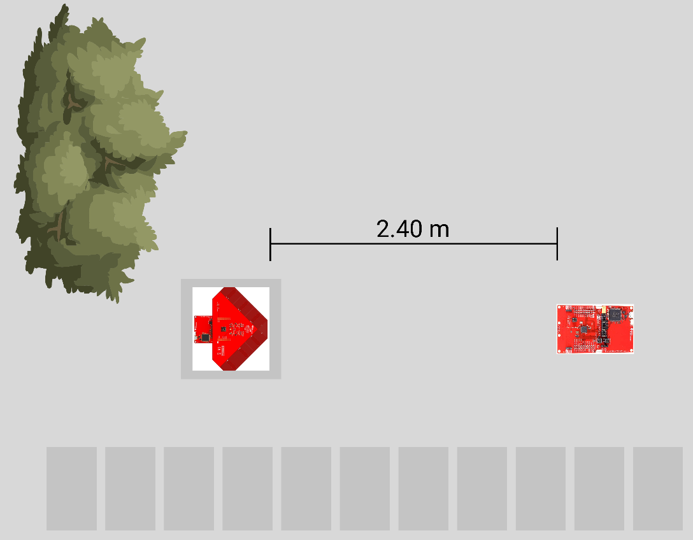
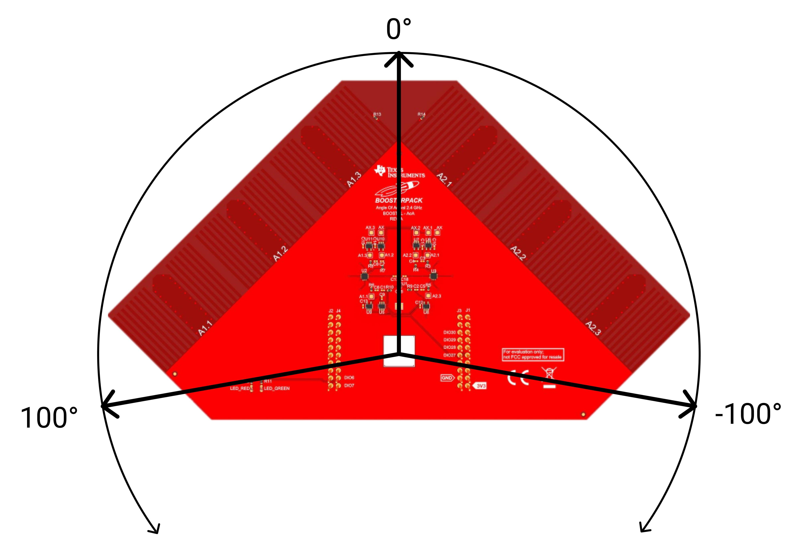
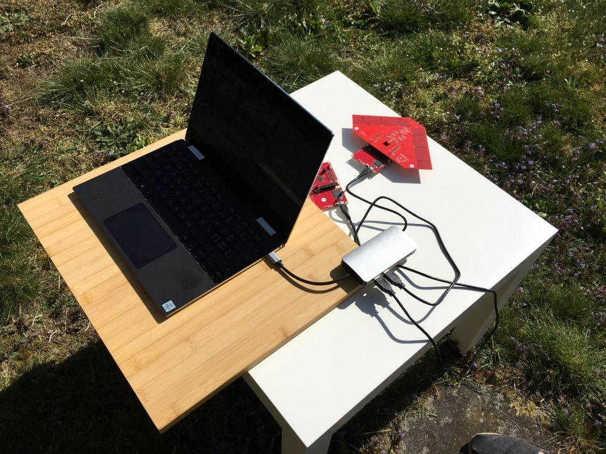

# Single Antenna Array Outdoor

The accuracy of a position measurement system depends on each individual antenna array. The following measurements deal with the variance and inaccuracy of a single antenna array. 

The measurements outside should give an approximate indication of how accurate measurement results can be made in open terrain. During these measurements all interfering signals such as mobile phones or laptop radio signals were switched off. There are also no large objects in the surrounding area which could influence the measured values by reflections.

## Measurement Setup

The following measurements were made outside in the garden. The arrangement of RTLS passive and RTLS slave is shown below. Both modules are located 76 cm above the floor (table height). The RTLS Master is also on the table, but is not shown for simplicity.

In the following experiments the antenna array (RTLS Passive) is rotated between -100° and 100°. -100° is on the left side of the array, 100° on the right. If the antenna array is pointing straight at the RTLS slave, the test setup is at an angle of 0°.

## Real Environment

|||
|:------|:-----------|

## Measurement Results

During all measurements, values were recorded for 5 minutes in order to filter out faulty measurements and to output a mean value of the measured signals that was as accurate as possible. All measurements were taken with the same distance of 2.4 meters between antenna array and slave unit. For each measurement the antenna array was aligned at a different angle. In addition to the measured angle and signal strength, the minimum and maximum values as well as the average value are listed. 

<MeasurementList
    AntennaOrientation="-90°"
    :AngleValues="['-84.893', '-93', '-65']"
    :RSSIValues="['-62.585', '-65', '-60']"
    :Images="['/assets/img/measurements/singleAntenna/minus90_Angle_outdoor.png', '/assets/img/measurements/singleAntenna/minus90_RSSI_outdoor.png']"
/>

<MeasurementList
    AntennaOrientation="-45°"
    :AngleValues="['-48.389', '-51', '-46']"
    :RSSIValues="['-57.809', '-59', '-57']"
    :Images="['/assets/img/measurements/singleAntenna/minus45_Angle_outdoor.png', '/assets/img/measurements/singleAntenna/minus45_RSSI_outdoor.png']"
/>

<MeasurementList
    AntennaOrientation="0°"
    :AngleValues="['-0.049', '-6', '10']"
    :RSSIValues="['-63.559', '-66', '-62']"
    :Images="['/assets/img/measurements/singleAntenna/0_Angle_outdoor.png', '/assets/img/measurements/singleAntenna/0_RSSI_outdoor.png']"
/>

<MeasurementList
    AntennaOrientation="45°"
    :AngleValues="['41.491', '39', '44']"
    :RSSIValues="['-57.981', '-59', '-57']"
    :Images="['/assets/img/measurements/singleAntenna/45_Angle_outdoor.png', '/assets/img/measurements/singleAntenna/45_RSSI_outdoor.png']"
/>

<MeasurementList
    AntennaOrientation="90°"
    :AngleValues="['83.407', '74', '87']"
    :RSSIValues="['-63.920', '-66', '-63']"
    :Images="['/assets/img/measurements/singleAntenna/90_Angle_outdoor.png', '/assets/img/measurements/singleAntenna/90_RSSI_outdoor.png']"
/>

Minimum and maximum values of the angle measurements can be compared against each other. 

|Measurement Angle|Angle Variance|RSSI Variance|
|:------|:----------|:----------|
|-90°   |	28°	    |   5 dBm  |
|-45°   |	5°      |	2 dBm   |
|0°     |	16°     |	4 dBm   |
|45°    |	5°      |	2 dBm   |
|90°    |	13°     |	3 dBm   |

We have a maximum angle difference of 28°. When we consider the curve, a single deflection is seen at about -65°. If these values are not observed, an approximate difference of 18° results. So we are at the difference of the other measurements, on average there is an inaccuracy of 5° to 15°. If the results are compared with the measurements in offices, the angle values are only conditionally more accurate. Generally speaking, measurements at 45° and -45° are the most accurate. With these angle settings, the signal waves hit the antenna array at right angles and can therefore be evaluated more accurately. This can also be seen in the series of measurements in the offices.
