# Triple Antenna Array

As can be seen from the previous measuring chapters, the accuracy of the angle measurement decreases with increasing distance. To counteract this inaccuracy, another antenna array is set up on the opposite side. With this additional measurement information it should be possible to filter out inaccurate measurement values and increase the position accuracy. 

The measurement setup is shown in the figure below and consists of three antenna arrays and one slave module. The twelve red rectangles represent the different measurement positions of the slave module. The left and right measurement series are each 0° in front of the one antenna array, the middle measurement series exactly in between. The rear antenna array is turned 180° and was aligned with the middle row. The distance of the measurements are at 2m, 4m, 6m and 8m, all modules are 76cm above the ground.

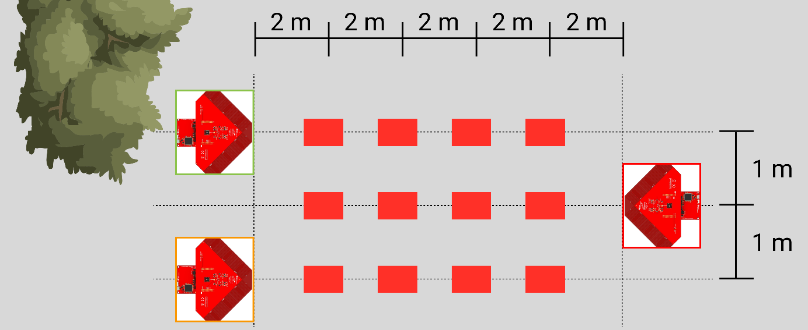

The following measurement evaluations are divided into measurements left, middle and right. The view is from behind the antenna arrays and is shown below. To make the evaluation more clearly arranged, the left antenna array is highlighted in green, the right one in orange and the rear one in red. The measurement results are referenced in these colours.

## Calculation of Positions

This measurement evaluation evaluates only directly measured position intersections. No filter functions or averaging are used; the displays refer to the original values. As measuring point the evaluation was selected in two meters in the middle.

For each location of the measurement on the measurement grid, a series of angle values per antenna array is obtained. As shown in the picture below, the position intersections of two antenna arrays are calculated first. With three antenna arrays, there are three possible combinations of antenna arrays. One color is assigned to the position intersections for each combination. 

| Right & Rear     | Right & Left    | Left & Rear     |
|----------|----------|-----------|
|(Array orange & red)| (Array green & orange)   | (Array green & red)   |
|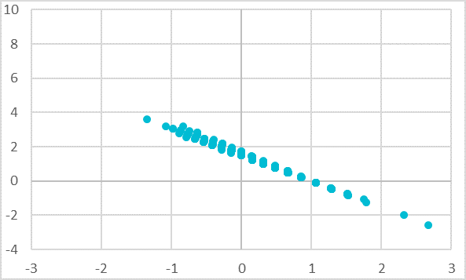|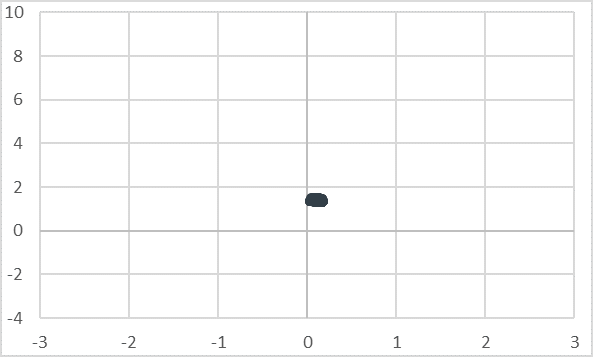|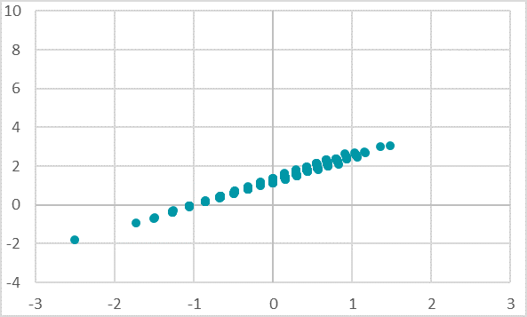|

If these three evaluations are now superimposed, an approximate intersection of the measuring points can be read. This intersection is only approximately determined and could be refined in a further evaluation with filter functions or averaging. In the picture below the combined evaluation was inserted into the grid of the measurement setup. 

Here again the results of the previous measurement series can be read off. The angle evaluation is most accurate at an angle of ±45°. Thus the scattering and inaccuracy of the measuring point evaluation comes from the rear antenna array, which is located at approx. 0° and furthest away. The combined measurement evaluation of the right and left antenna arrays has practically no scattering, since both angle evaluations are at approx. ±45°.

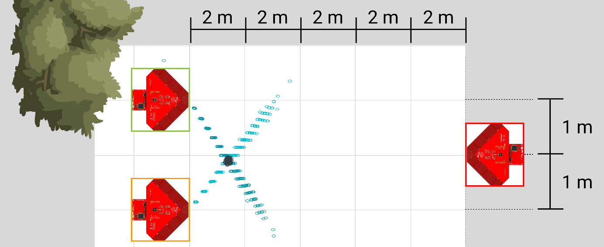

This minimum scattering of the position intersections from the antenna array on the right and left (green and orange) is shown in the separate evaluation in the picture below in a more precise resolution. Here it is again evident that at ±45° and at close range (2m) the inaccuracy is relatively small. We read out here a lateral inaccuracy of approx. 30cm and a longitudinal inaccuracy of approx. 25cm. 
Besides the relatively small scattering, the offset of the measuring position is striking. The theoretical measuring point was at 0m in the middle and 2m in the back. Here the center is at 0.1m right and 1.4m back. This offset is due to the fact that the measurement setup was not calibrated. All antenna arrays were aligned by eye and may deviate a few degrees from the theoretical alignment. With a marketable system, either a calibration would be performed or the antenna array would be equipped with a compass sensor to determine the exact orientation. However, the aim of these series of measurements is to determine the scattering and not to include a position offset, so this is acceptable.

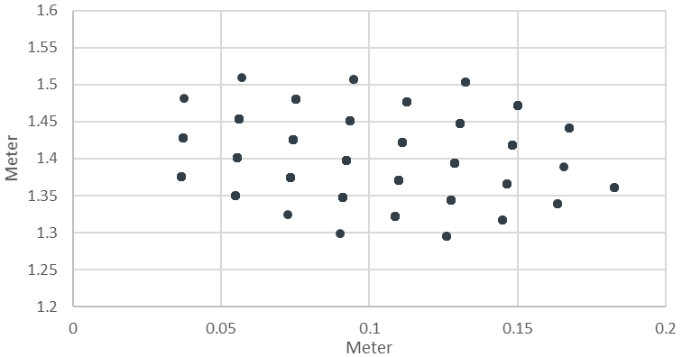

## Evaluation Intersection Points

The other measuring sites are evaluated according to the same principle as described above. The colouring of the position intersections continues with the same colour scheme, which is listed below.

|       | Left     | Middle    | Right     |
|-------|----------|----------|-----------|
| 2m    |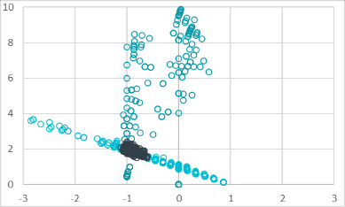|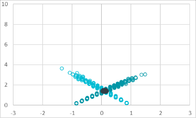|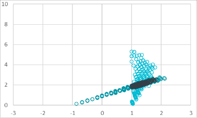|
| 4m    |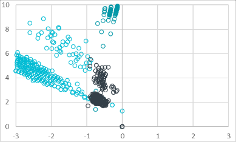|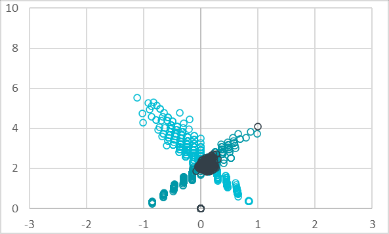|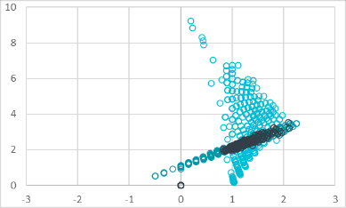|
| 6m    |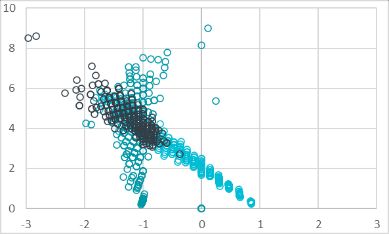|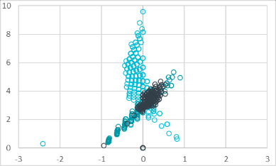|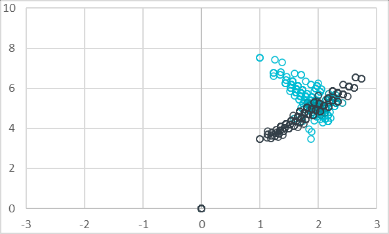|
| 8m    |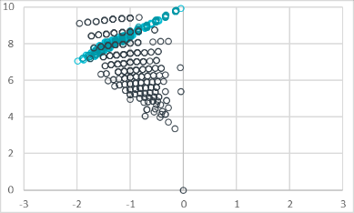|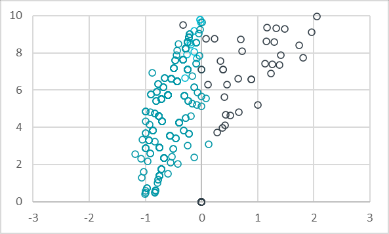|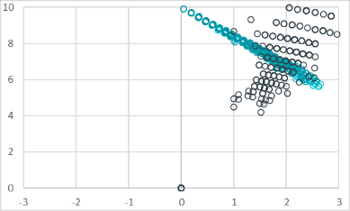|

This evaluation in turn confirms the previous findings. The finding that the angle evaluation of an antenna array at ±45° is most accurate can be observed at the central positions at a distance of 2m-6m. There the black intersections have the smallest scattering, at the intersections with the rear antenna array only the angle of the rear antenna array is inaccurate.

The opposite confirmation can be seen at the measuring positions right and left in 8m distance. For this purpose, the evaluation at a distance of 8m left is combined with auxiliary lines in the separate picture.

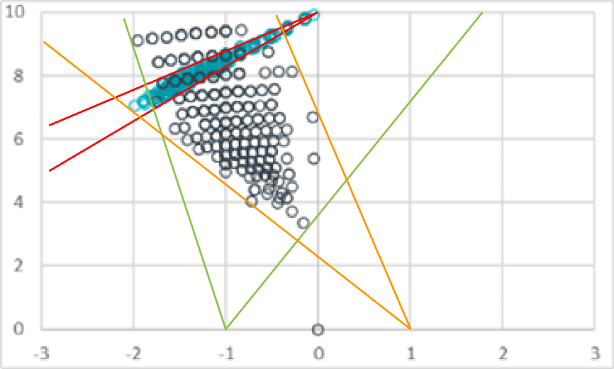

The red auxiliary line shows that the angle evaluation of the rear antenna array is relatively accurate. The scattering of the measuring positions on the red line leads from the two antenna arrays on the right and left. This inaccuracy is shown by the green and orange lines. 
The black points of the position evaluation originate from the antenna arrays left and right as in the previous examples. These points are located in the intersection of these two inaccuracies. The larger distance and the measurement position in 0° orientation (green array) explain this large intersection area. 

The same characteristics can also be seen at the measuring position on the left at a distance of 2m. The angle of the orange antenna array at approx. 45° and at close range is relatively constant. The angle of the green antenna array at approx. 0° already has a lot more scattering. With the increasing distance of the rear red antenna array, the scattering becomes too large to make accurate statements about the position.

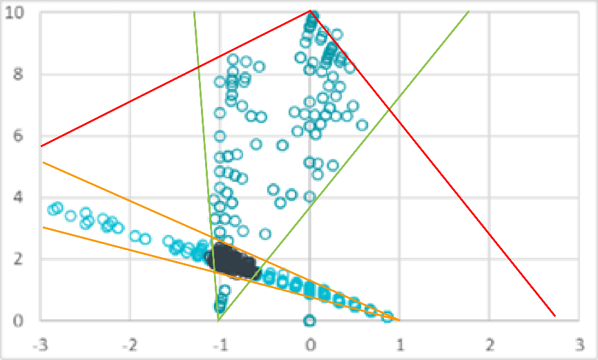

